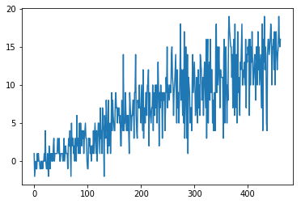
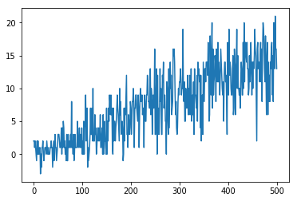
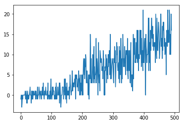
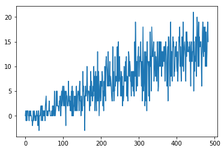
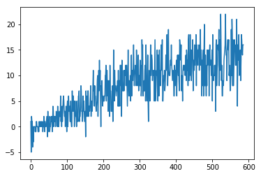

# Project I: Navigation
## Introduction
The project uses Deep Reinforcement Learning algorithm to train an agent to navigate and collect fruits in a large, square world. 

## Project Details
#### State-Space
The state space has 37 dimensions and contains the agent's velocity, along with ray-based perception of objects around the agent's forward direction. Given this information, the agent has to learn how to best select actions. Four discrete actions are available, corresponding to:

-   **`0`**  - move forward.
-   **`1`**  - move backward.
-   **`2`**  - turn left.
-   **`3`**  - turn right.
#### Rewards and Completion
A reward of +1 is provided for collecting a yellow banana, and a reward of -1 is provided for collecting a blue banana. Thus, the goal of your agent is to collect as many yellow bananas as possible while avoiding blue bananas.
The task is episodic, and in order to solve the environment, your agent must get an average score of +13 over 100 consecutive episodes.
## Learning Algorithm
### Deep Q Network
The algorithm used to train the agent is Deep Q Learning in which we use a neural network to approximate the Q-value function.

The external loop of the algorithm executes until either the maximum number of episodes (by default: 2000) is reached or the environment is considered as solved (100 consecutive episodes have the mean score of >= 13).
The internal loop controls the agent by getting its current action and using it to get state and reward from the environment. 
After that, the agent takes returned parameters of state, action, reward, next state to the next training step.
For each training, agents with different hyperparameters are constructed which then use the Deep Q Learning training algorithm to see each agent's results.

The Agent class used consists of:
- Local and Target Q-Networks:
self.qnetwork_local = QNetwork(state_size, action_size, seed, fc1_units, fc2_units).to(device) 
self.qnetwork_target = QNetwork(state_size, action_size, seed, fc1_units, fc2_units).to(device)
- Replay Memory:
self.experience = namedtuple("Experience", field_names=["state", "action", "reward", "next_state", "done"])
e = self.experience(state, action, reward, next_state, done) self.memory.append(e)
- Epsilon-Greedy algorithm:
if random.random() > eps: 
	return np.argmax(action_values.cpu().data.numpy())
	else: 
	return random.choice(np.arange(self.action_size))
- MSE loss function optimised by ADAM gradient descent algorithm:
loss = F.mse_loss(Q_expected, Q_targets)
### Hyperparameters and Neural Networks
The neural network used in the task consists of three Fully-Connected layers:
-   Layer fc1, number of neurons:  state_size  x  _fc1_units
-   Layer fc2, number of neurons:  fc1_units  x  _fc2_units
-   Layer fc3, number of neurons:  fc2_units  x  _action_size

Since state and action sizes are constant, the main difficulty is to find an appropriate number of neurons (fc1_units and fc2_units). To achieve this, we use random module to pick certain number of neurons and then evaluate the agent:
- pick the number of neurons for each of the FC layer:
    fc1 = random.randrange(48, 128, 16)
    fc2 = random.randrange(fc1 - 16, fc1 + 16, 8)
    epsilon = random.randrange(980, 995, 1)/1000.
- create the agent and train it
    agent = Agent(state_size = 37, action_size = 4, seed = 1, fc1_units = fc1, fc2_units = fc2)
    score, episode = dqn(eps_start = epsilon)
  
The neurons in the first FC layer can take number from 48 to 128 with a step of 16, so: 48, 64, 80, 96, 112, 128. For the second layer it is a number that ranges between the result of the first layer neurons minus 16, to the result of the first layer neurons plus 16 with a step of 8. Epsilon is picked as an integer from 980 to 995 divided by 1000.
In total five different combinations of hyperparameters are tested and the result are shown in the next section.
## Rewards and Plotting
Training:  0
Epsilon:  0.993
FC_1:  48 FC_2:  32
Episode: 0, Score: 1.0, Mean_100: 1.0, Epsilon: 0.988035
Episode: 100, Score: -1.0, Mean_100: 1.21, Epsilon: 0.5985223932181167
Episode: 200, Score: 5.0, Mean_100: 4.84, Epsilon: 0.3625671713892139
Episode: 300, Score: 13.0, Mean_100: 8.63, Epsilon: 0.21963247366965266
Episode: 400, Score: 15.0, Mean_100: 10.99, Epsilon: 0.13304685944240371
Episode: 461, Score: 16.0, Mean_100: 13.01, Epsilon: 0.09799694861142572

============ end of training ============
Training:  1
Epsilon:  0.984
FC_1:  48 FC_2:  32
Episode: 0, Score: 2.0, Mean_100: 2.0, Epsilon: 0.97908
Episode: 100, Score: 0.0, Mean_100: 1.19, Epsilon: 0.5930977189593419
Episode: 200, Score: 7.0, Mean_100: 3.99, Epsilon: 0.3592810640956556
Episode: 300, Score: 11.0, Mean_100: 7.81, Epsilon: 0.21764184702007852
Episode: 400, Score: 10.0, Mean_100: 10.61, Epsilon: 0.1318409966680012
Episode: 500, Score: 13.0, Mean_100: 13.02, Epsilon: 0.07986537809894768
Episode: 500, Score: 13.0, Mean_100: 13.02, Epsilon: 0.07986537809894768

============ end of training ============
Training:  2
Epsilon:  0.992
FC_1:  64 FC_2:  56
Episode: 0, Score: -1.0, Mean_100: -1.0, Epsilon: 0.98704
Episode: 100, Score: -1.0, Mean_100: 0.12, Epsilon: 0.5979196516338079
Episode: 200, Score: 5.0, Mean_100: 1.53, Epsilon: 0.36220204835659575
Episode: 300, Score: 7.0, Mean_100: 6.43, Epsilon: 0.21941129293081066
Episode: 400, Score: 11.0, Mean_100: 8.95, Epsilon: 0.13291287468969204
Episode: 490, Score: 16.0, Mean_100: 13.03, Epsilon: 0.08465338296479194

============ end of training ============
Training:  3
Epsilon:  0.991
FC_1:  48 FC_2:  40
Episode: 0, Score: 0.0, Mean_100: 0.0, Epsilon: 0.986045
Episode: 100, Score: 3.0, Mean_100: 0.92, Epsilon: 0.5973169100494995
Episode: 200, Score: 4.0, Mean_100: 3.95, Epsilon: 0.3618369253239781
Episode: 300, Score: 8.0, Mean_100: 7.73, Epsilon: 0.21919011219196907
Episode: 400, Score: 10.0, Mean_100: 10.83, Epsilon: 0.13277888993698078
Episode: 483, Score: 15.0, Mean_100: 13.05, Epsilon: 0.08758802535472016

============ end of training ============
Training:  4
Epsilon:  0.982
FC_1:  80 FC_2:  88
Episode: 0, Score: 1.0, Mean_100: 1.0, Epsilon: 0.97709
Episode: 100, Score: 4.0, Mean_100: 0.98, Epsilon: 0.5918922357907251
Episode: 200, Score: 5.0, Mean_100: 4.43, Epsilon: 0.3585508180304206
Episode: 300, Score: 8.0, Mean_100: 8.54, Epsilon: 0.21719948554239546
Episode: 400, Score: 11.0, Mean_100: 10.25, Epsilon: 0.1315730271625785
Episode: 500, Score: 5.0, Mean_100: 12.24, Epsilon: 0.07970305009468157
Episode: 585, Score: 16.0, Mean_100: 13.07, Epsilon: 0.05205192613009242

============ end of training ============

It turns out that the fastest agent that completed the environment in 461 episodes has the hyperparameters of:
- fc1_units: 48
- fc2_units: 32
- epsilon: 0.993

Overall all the five agents were able to solve the problem in a very reasonable number of episodes.
## Future Work Ideas
The performance could be improved in many ways, some of them are:
- adding more layers to the neural network for better approximation
- testing more combinations of neural units to see better correlation between them and the results
- implementing different, more complex algorithms like Dueling Double DQN or using Prioritised Experience Replay.